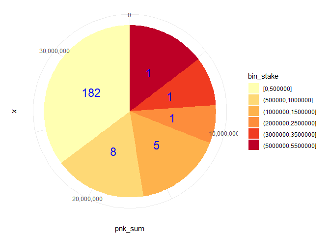

    ## Warning: package 'ghql' was built under R version 4.0.5

    ## Warning: package 'jsonlite' was built under R version 4.0.5

    ## Warning: package 'dplyr' was built under R version 4.0.5

    ## Registered S3 methods overwritten by 'tibble':
    ##   method     from  
    ##   format.tbl pillar
    ##   print.tbl  pillar

    ## 
    ## Attaching package: 'dplyr'

    ## The following objects are masked from 'package:stats':
    ## 
    ##     filter, lag

    ## The following objects are masked from 'package:base':
    ## 
    ##     intersect, setdiff, setequal, union

    ## Warning: package 'ggplot2' was built under R version 4.0.5

    ## Warning: package 'ineq' was built under R version 4.0.3

Introduction
============

Getting the data
================

Establishing connection with the subgraph, acquiring data

    con <- GraphqlClient$new(
      url = "https://api.thegraph.com/subgraphs/name/shenwilly/kleros-liquid"
      
    )

Getting data using GraphQL queries. Limit is 1000 items so 2 queries
needed to be done, then merged.

    # First query
    qry <- Query$new()

    qry$query('jurorlist','{
                jurors(first: 1000) {
                  id
                  jurorStakes {
                    id
                    subcourt {
                      id
                    }
                    stakedToken
                  }
                stakedToken
                
                subCourts {
                  id
                }
                }
              }')

    (x <- con$exec(qry$queries$jurorlist))
    pre_transform <- jsonlite::fromJSON(x)

    raw_data <- pre_transform$data$jurors # Extract json data into an R data frame

    # Repeat process for the following 1000s:

    qry <- Query$new()
    qry$query('jurorlist','{
                jurors(first: 1000, skip:1000) {
                  id
                  jurorStakes {
                    id
                    subcourt {
                      id
                    }
                    stakedToken
                  }
                stakedToken
                
                subCourts {
                  id
                }
                }
              }')

    (x <- con$exec(qry$queries$jurorlist))
    pre_transform <- jsonlite::fromJSON(x)
    raw_data2 <- pre_transform$data$jurors

And now we merge both data frames into one

    # Merging both data frames 

    merged <- rbind(raw_data,raw_data2)

    rm(raw_data,raw_data2, pre_transform) # clean up

Now some databased pruning mostly with the `tidyverse` tools

    # Unnesting the jurorStakes column, which is a list

    unnested <- merged %>% unnest(jurorStakes, names_repair = "universal") 

    ## New names:
    ## * id -> id...1
    ## * id -> id...2
    ## * stakedToken -> stakedToken...3
    ## * stakedToken -> stakedToken...5

    # Subsetting only the Humanity Court. Reformatting amount of PNK

    filtrado <- unnested %>%
                filter(subcourt == 23) %>%
                mutate(tokenNumeric = as.numeric(stakedToken...3)/10^18)

Now we create a binned frequency table dividing the base into 500k
categories

    # bin frequency table, cada 500k

    bin_freq <- filtrado %>%
      select(tokenNumeric) %>%
      group_by(bin_stake = cut_width(tokenNumeric, width = 500000, boundary = 0, dig.lab = 12)) %>%
      summarise(n_Wallets = n(), pnk_sum = sum(tokenNumeric)) 

This generates the following table:

    bin_freq

    ## # A tibble: 6 x 3
    ##   bin_stake         n_Wallets   pnk_sum
    ##   <fct>                 <int>     <dbl>
    ## 1 [0,500000]              182 12315344.
    ## 2 (500000,1000000]          8  6025527.
    ## 3 (1000000,1500000]         5  5768413.
    ## 4 (2000000,2500000]         1  2494000 
    ## 5 (3000000,3500000]         1  3225000 
    ## 6 (5000000,5500000]         1  5117346

And for the plot, using the R package `ggplot2`:

    # setting up the proper scale
    count.data <- bin_freq %>%
      arrange(desc(bin_stake)) %>%
      mutate(lab.ypos = cumsum(pnk_sum) - 0.5*pnk_sum)

    # Primordial ggplot object
    bp <- ggplot(count.data, aes(x="", y=pnk_sum, fill=bin_stake))+ geom_bar(width = 1, stat = "identity")

    # Creating the pie chart
    bp + coord_polar("y", start=0) + 
      scale_fill_brewer(palette = "YlOrRd") +
      theme_minimal() + 
      scale_y_continuous(labels = comma) +
      geom_text(aes(y = lab.ypos, label = n_Wallets), color = "blue", size = 6)

